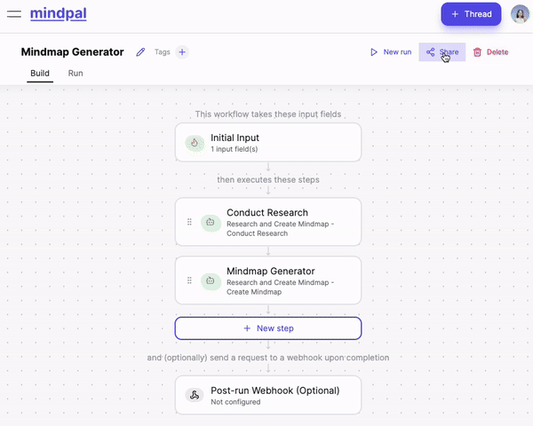

# AI Builder Kit
Build your own AI tools & Group them in one Hub

## Introduction
Welcome to the AI Builder Kit - an open-source project that helps you build your own AI tools and group them into one central hub. 

## Use Cases
### Some suggested use cases can be:
👉 Create a central repository of **content writing AI tools** for all your social media sites<br>
👉 Make a hub of **AI tools for podcast** and streamline your team's workflows.<br>
👉 Build a **SEO Writing AI tools** hub and monetize your expertise.<br>
👉 Develop a hub of **AI tools for business consulting** and monetize it.<br>
### Check out some of these sites for reference:
🔗 [MindPal Tools Hub for more AI Tools Ideas](https://mindpal.space/workflow)<br>
🔗 [AI Hub of Education Tools](https://edu.freeaitools.tech/)<br>
🔗 [AI Hub of SEO Writing Tools](https://seo.freeaitools.tech/)<br>
🔗 [AI Hub of Podcasting Tools](https://podcast.freeaitools.tech/)<br>

## Features
✅ **Straightforward Process**: Quickly create your own AI tools at [MindPal](https://mindpal.space/). Then group them into a single hub with this buildkit. <br>
✅ **Fully Customizable Hub**: The hub offers extensive customization options (eg. change themes, add API / Database, etc); ensure to meets the needs of you, your team, or your clients. <br>
✅ **Show Your Work**: Showcase and monetize your well-crafted AI Tools at ease. <br>

## Getting Started

### Prerequisites
- Node.js (>=14.0.0)
- npm or yarn

### Installation

1. Clone the repository:

    ```bash
    git clone https://github.com/chanitypham/ai-hub-buildkit.git
    ```

2. Navigate to the project directory:

    ```bash
    cd ai-hub-buildkit
    ```

3. Install dependencies:

    ```bash
    npm install
    # or
    yarn install
    ```

4. Start the development server:

    ```bash
    npm run dev
    # or
    yarn dev
    ```

## Usage

1. Create your own AI Tools on [MindPal](https://mindpal.space/). The process is very straightforward, and creation time takes from 1-2 minutes. As MindPal is quite feature-rich, it is recommended to follow the tutorials [here](https://www.youtube.com/watch?v=CcXvHkBQuSE) so you can make the most customized AI tools for your need.

2. Click Share your tool & copy the Tool ID, see the GIF below

- The ID would be something like `69b2c0364d31ec6f5ec0361` by default, or `example-workflow-name` if you customize it.

3. Add a new tool in your hub
To add a new AI tool, create a new entry in the `lib/tools.tsx` file by copying the given in-file template. Example:
    ```
    {
        slug: "podcast-guest-researcher", 
        // the slug that, when clicked on, will open your tool on, for example: https://your_website/podcast-guest-researcher

        icon: "🔍", 
        // icon of the tool for visuals

        title: "Podcast Guest Researcher", 
        // title of the tool

        description: "Streamlines the process of researching podcast guests", 
        // description of the tool

        category: "", 
        // optional, can categorize your tools

        workflowID: "669b2c0364d31ec6f5ec0361", 
        // the ID of the workflow on MindPal, can be viewed when sharing the link, it is the ID after `https://workflow.mindpal.space/669b2c0364d31ec6f5ec0361` 

        copywriting: "The Podcast Guest Researcher is an innovative tool designed to enhance your podcasting experience by streamlining the preparation process for interviews. ", 
        // A more detailed introduction to your tools, so you can share it with others
    }, 
    ```

4. Explore the codebase and customize the appearance and functionality of your AI hub.

## Contributing

We welcome contributions from the community! To contribute:

1. Fork the repository.
2. Create a new branch (`git checkout -b feature-branch`).
3. Make your changes and commit them (`git commit -m 'Add new feature'`).
4. Push to the branch (`git push origin feature-branch`).
5. Create a Pull Request.

## Reporting Issues
If you encounter any issues or bugs, please report them by submitting an issue on this repository. When submitting an issue, please include:
- A clear description of the problem.
- Steps to reproduce the issue.
- Any relevant screenshots or error messages.
- Providing detailed information will help us resolve the issue more effectively.

## Acknowledgement
- This project is created with the support from [MindPal Labs](https://mindpal.space/)

## Creator Contact
For any inquiries or support, please reach out to me (Chanity) at [trang.pq@mindpal.io](mailto:trang.pq@mindpal.io).

Have fun Building! 🥳